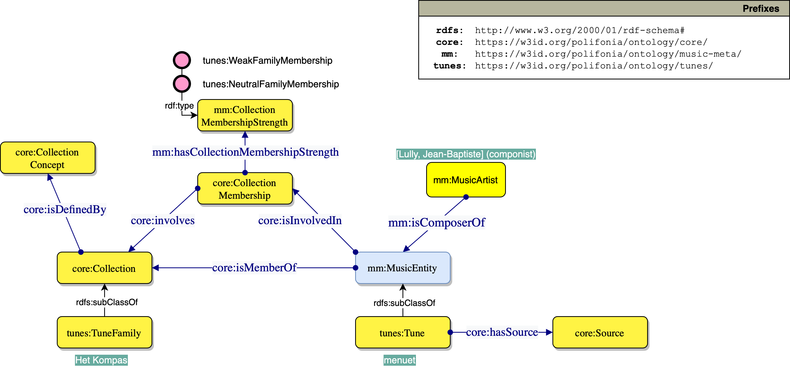
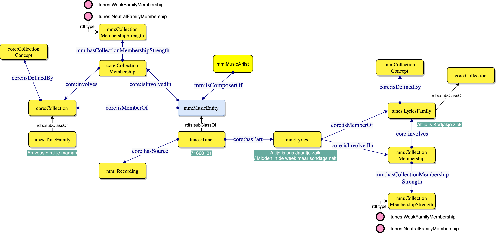

# tunes-ontology
A specialisation of [Music Meta](https://github.com/polifonia-project/musicmeta-ontology) for folk music

The main novelty at the metadata level consists in grouping *tunes* into *tune families* depending on their similarity (an association that is often performed through manual inspection and analysis). Each `tunes:Tune` is seen as a specialisation of a `mm:MusicEntity` that may belong to a `tunes:TuneFamily`, which in turn specialises `mm:Collection` (please, note that the term *Collection* is seen from an ontology engineering perspective, as this reuses the Collection ontology design pattern in Music Meta).

As can be seen from the diagram/example below, the membership of a `tunes:Tune` to `tunes:TuneFamily` is described by `mm:CollectionMembership`, which provides additional information on the actual strength of such membership. The latter is captured by `mm:CollectionMembership`, which is specialised by two entities here: `tunes:WeakFamilyMembership` and `tunes:NeutralFamilyMembership`.

Another extension that is peculiar to folk music, is the possibility to group tunes' `mm:Lyrics` into a `tunes:LyricsFamily`. This is analogous to `tunes:TuneFamily` as described above. The same criteria for expressing membership strength apply as before. As shown in the diagram/example below, a tune and lyrics families are not exclusive.

## Competency questions addressed

WIP

## Examples of SPARQL queries addressed

WIP

